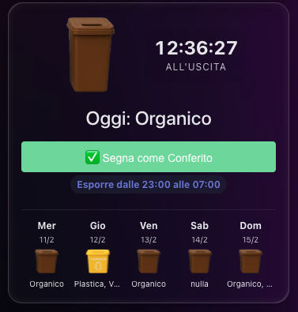

# Gestione Rifiuti (Waste Manager)

Componente personalizzato per Home Assistant per la gestione della raccolta differenziata settimanale. Include una card personalizzata per visualizzare il calendario in stile meteo.



## Caratteristiche
- 📅 **Configurazione UI**: Imposta i giorni di ritiro direttamente da Home Assistant.
- ♻️ **Multi-tipologia**: Supporta più tipi di rifiuti per lo stesso giorno (es. "Plastica, Vetro").
- 🔮 **Sensore Intelligente**: `sensor.next_waste_pickup` ti dice cosa c'è oggi, domani o nei prossimi giorni.
- 🖼️ **Card Personalizzata**: Include una `waste-card` per Lovelace con icone personalizzate.

## Installazione

### Tramite HACS (Consigliato)
1. Assicurati di avere [HACS](https://hacs.xyz/) installato.
2. Aggiungi questo repository come **Repository Personalizzato**:
   - Vai su HACS > Integrazioni.
   - Clicca sui 3 pallini in alto a destra > **Repository personalizzati**.
   - Incolla l'URL di questo repository Github.
   - Categoria: **Integration**.
   - Clicca **Aggiungi**.
3. Cerca "Gestione Rifiuti" e clicca **Scarica**.
4. Riavvia Home Assistant.

### Installazione Manuale
1. Scarica la cartella `custom_components/waste_manager` da questo repository.
2. Copiala dentro la cartella `custom_components` del tuo Home Assistant (`/config/custom_components/`).
3. Riavvia Home Assistant.

## Configurazione
1. Vai su **Impostazioni** > **Dispositivi e Servizi**.
2. Clicca su **Aggiungi Integrazione**.
3. Cerca **Gestione Rifiuti**.
4. Compila i campi per ogni giorno della settimana.
   - Scrivi il tipo di rifiuto (es. `Umido`).
   - Se hai più ritiri, separali con una virgola (es. `Secco, Plastica`).

## Aggiunta della Card
Per vedere la card personalizzata:

1. Vai nella tua Dashboard > Modifica (matita in alto) > 3 puntini > **Gestisci risorse**.
2. Aggiungi Risorsa:
   - URL: `/local/waste_manager/waste_card.js`
   - Tipo: `Modulo JavaScript`
3. Nella Dashboard, aggiungi una scheda **Manuale** e incolla:
   ```yaml
   type: custom:waste-card
   entity: sensor.next_waste_pickup
   ```

## Icone Personalizzate
Le immagini dei rifiuti si trovano in `custom_components/waste_manager/rifiuti/`.
Il componente cerca automaticamente l'immagine basandosi sul nome del rifiuto (es. se contiene "plastica" usa `plastica.png`).
File inclusi: `plastica.png`, `carta.png`, `umido.png`, `vetro.png`, `indifferenziata.png`, `metallo.png`, `verde.png`.
